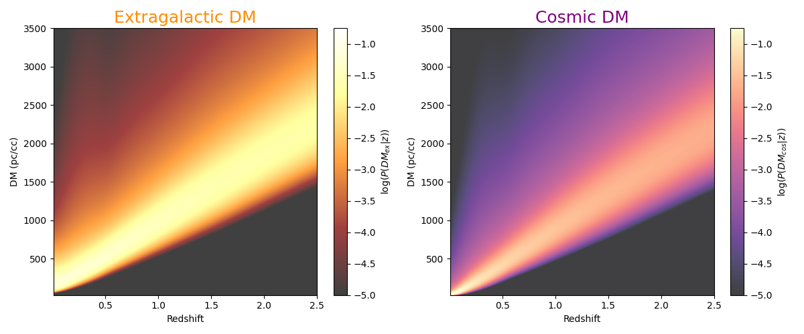

This repository hosts code and data associated with the publication 
Connor et al. (2024) on partitioning the Universe's baryons with fast radio bursts. It is a reproduction package of the 
analysis and figures in that work. 

##
We have fit Macquart PDFs for both extragalactic DM (host + cosmic) and cosmic only DM (IGM and intervening halos). These arrays are P(DM | z), not 2D PDFs. These can be found [here](https://github.com/liamconnor/frb_baryon_connor2024/blob/main/data/pdm_connor_etal_2025.h5). 

Start by reading in the data:

```
import numpy as np
import h5py
import matplotlib.pylab as plt

f = h5py.File("pdm_connor_etal_2025.h5", "r")

prob_dmcos_z = f["prob_dmcos_z"][:]
prob_dmex_z = f["prob_dmex_z"][:]
redshift = f["redshift"][:]
dmex = f["DM"][:]
f.close()
```

Next, we can plot the empirical probability distributions.  

```
fig = plt.figure(figsize=(12,5))
plt.subplot(121)
plt.imshow(np.log10(prob_dmex_z[::-1] + 1e-32), 
       extent=[redshift.min(), redshift.max(), dmex.min(), dmex.max()],
       vmax=-0.75, vmin=-5,
      aspect='auto', cmap='afmhot', alpha=0.75)
plt.colorbar(label=r'$\log(P(DM_{ex} | z))$', )
plt.xlabel('Redshift')
plt.ylabel('DM (pc/cc)')
plt.title('Extragalactic DM', fontsize=18, color='darkorange')

plt.subplot(122)
plt.imshow(np.log10(prob_dmcos_z[::-1] + 1e-32), 
           extent=[redshift.min(), redshift.max(), dmex.min(), dmex.max()],
           vmax=-0.75, vmin=-5,
           aspect='auto', cmap='magma', alpha=0.75)
plt.colorbar(label=r'$\log(P(DM_{cos} | z))$')
plt.xlabel('Redshift')
plt.ylabel('DM (pc/cc)')
plt.tight_layout()
plt.title('Cosmic DM', fontsize=18, color='purple')
plt.savefig('example_pdfs.png')
```

That should produce:



## installation instructions

You can install in a virtual environment or with Poetry, which is a dependency management and packaging tool for Python. I usually use Poetry.

```bash
python3 -m venv baryon_env

source baryon_env/bin/activate

pip install -r requirements.txt
```

Or if you want to use Poetry,

```bash
pip install poetry
```

alternatively, 

```bash
curl -sSL https://install.python-poetry.org | python3 -
```

To install this particular poetry package you would do 

```bash
cd frb_baryon_connor2024
poetry install
```

Now to enter the poetry environment, do

```bash
poetry shell
```

You should now be able to run the code.

## src/frbdm_mcmc_jit.py
This program has code for JAX-compiled MCMC fitting code using emcee. It's still terribly slow due to computing a 2D integral for each new parameter, so if anybody wants to submit a PR to speed things up please do! That said, I never got it running on GPU, so maybe it just requires accelerated hardware.

Example usage:

To run on all FRBs in the dataset with no selection criteria

```bash
python frbdm_mcmc_jit.py 
```

To run only on DSA-110 discovered FRBs beyond z=0.0125 for 2000 MCMC steps

```bash
python frbdm_mcmc_jit.py --zmin 0.0125 --nmcmc 2000 --tel dsa-110
```

To run on all FRBs between 0.25 < z < 0.50 excluding, say, FRB20200430A

```bash
python frbdm_mcmc_jit.py --zmin 0.25 --zmax 0.50 --nmcmc 2000 --tel all --exclude FRB20200430A
```
